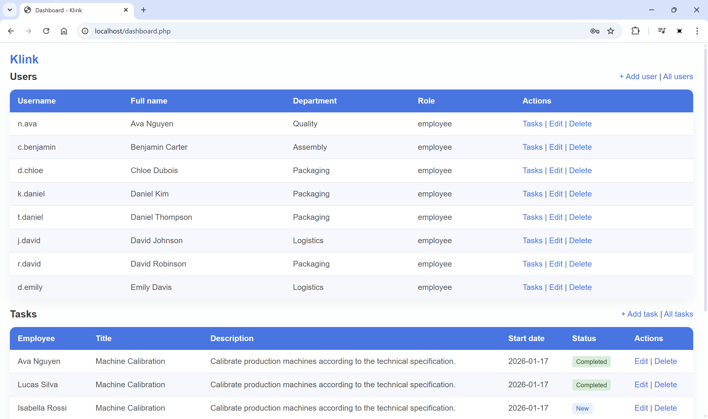

# Klink

Klink is a web-application for accounting for employees in production and managing their tasks. The project was developed as a part of university work. The application was implemented using **PHP**, **MySQL**, classic server architecture and secure development principles.

## Setup Instructions

Clone the repository:
```
git clone https://github.com/trenter39/klink.git
cd klink
```

### Local setup with XAMPP

1. Create `klink` database in **MySQL**.
```
create database klink;
```

2. Set up the database by running the `schema.sql` schema file.
```
mysql -u root -p klink < schema.sql
```

3. Configure connection to **MySQL** by creating `.env` file in the root folder. `.env` file must contain fields (example with default values):
```
DB_HOST=localhost
DB_USER=root
DB_PASS=password
DB_NAME=klink
```

4. Move folder to `c:/xampp/htdocs` and start server with XAMPP.

5. Change path to the folder in `c:/xampp/apache/conf/httpd.conf`:
```
DocumentRoot "C:/xampp/htdocs/klink/public"
<Directory "C:/xampp/htdocs/klink/public">
</Directory>
```

6. Now you can visit website via `http://localhost`.

### Docker Setup (Recommended)

1. For a quick out-of-the-box experience without manual database setup, run with Docker Compose:
```
docker-compose up --build
```

2. Now you can visit website via `http://localhost:8080`.

## Testing

Automated tests are implemented using **PHPUnit** and are intended to verify the core functionality of the application, including database interactions and business logic. Before running tests locally, make sure that all project dependencies are installed via **Composer** and that a test database connection is available.
```
composer install
vendor\bin\phpunit
```
> [!NOTE]
> All users have credentials in the following format: `name123`.
>
> For example, the admin account uses: `admin / admin123`, Daniel Thompson: `t.daniel / daniel123`

